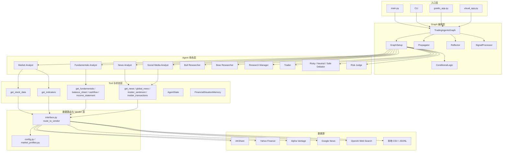
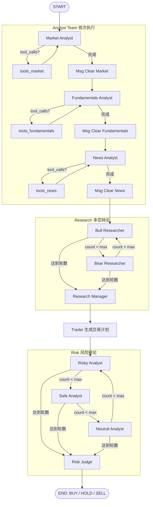
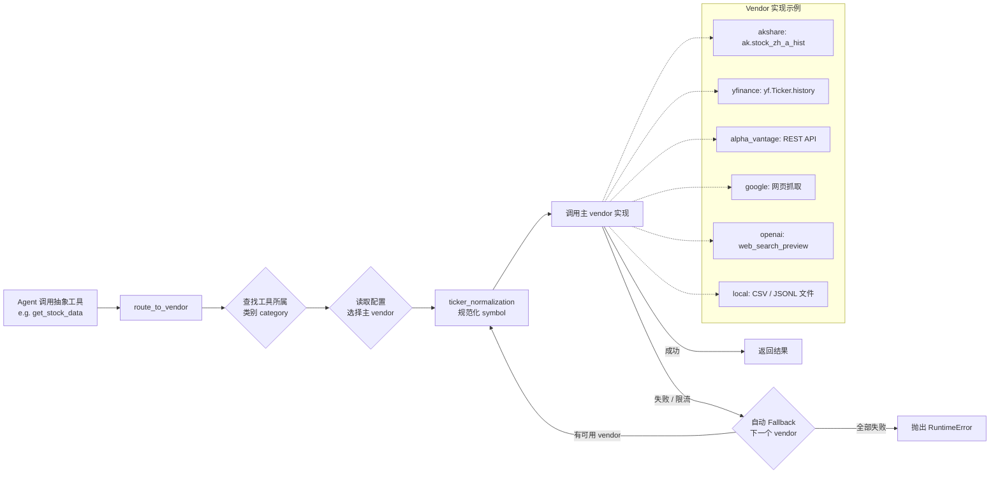

# TradingAgents 项目架构

## 1. 项目定位

TradingAgents 是一个基于多 Agent 协作的交易研究框架。
它的核心目标不是直接做高频执行，而是把一次交易研究过程拆成多个角色明确的 LLM Agent，按照固定流程协作完成分析、辩论、交易方案生成和风险裁决。

当前项目已经从最初偏美股的数据架构，扩展为同时支持：

- US Equity
- China A-Share

其中 China A-Share 当前已经支持：

- 行情分析
- 技术指标分析
- 基本面分析
- 中国公司新闻 / 公告分析
- 中国宏观 / 政策新闻分析

## 2. 总体分层

从代码结构上，这个项目可以分成 6 个主要模块：

1. 入口与交互层
2. Graph 编排层
3. Agent 角色层
4. Tool 与状态层
5. 数据路由与 Vendor 层
6. 配置、市场抽象与测试层

可以把整体关系理解成：

 ```text
 CLI / main.py
     -> TradingAgentsGraph
         -> LangGraph Workflow
             -> Agents
                 -> Tools
                     -> Vendor Router
                         -> Data Sources
 ```

### 2.1 ASCII 项目速查表

```text
┌──────────────────────────────────────────────────────────────────────────────────────┐
│                                  TradingAgents 项目速查表                           │
├────────────────────────────┬──────────────────────────────┬──────────────────────────┤
│ 模块                       │ 关键文件 / 目录              │ 主要职责                 │
├────────────────────────────┼──────────────────────────────┼──────────────────────────┤
│ 入口与交互层               │ main.py / cli/ / gradio_app  │ 接收用户输入并启动流程   │
├────────────────────────────┼──────────────────────────────┼──────────────────────────┤
│ Graph 编排层               │ trading_graph.py / setup.py  │ 组装 LangGraph 工作流    │
├────────────────────────────┼──────────────────────────────┼──────────────────────────┤
│ Agent 角色层               │ analysts/ researchers/       │ 完成分析、辩论、交易生成 │
│                            │ trader/ risk_mgmt/ managers/ │ 与最终裁决               │
├────────────────────────────┼──────────────────────────────┼──────────────────────────┤
│ Tool 与状态层              │ agents/utils/                │ 向 Agent 提供统一工具接口 │
│                            │                              │ 并维护状态与 memory      │
├────────────────────────────┼──────────────────────────────┼──────────────────────────┤
│ 数据路由与 Vendor 层       │ dataflows/interface.py       │ 选择 vendor 并处理回退   │
├────────────────────────────┼──────────────────────────────┼──────────────────────────┤
│ 数据源实现层               │ akshare / yfinance /         │ 实际采集行情、指标、新闻 │
│                            │ alpha_vantage / openai 等    │ 与基本面数据             │
└────────────────────────────┴──────────────────────────────┴──────────────────────────┘
```

### 2.2 ASCII 主执行流程图

```text
┌──────────────────────────────┐
│ 用户输入                     │
│ ticker / trade_date / market │
└──────────────┬───────────────┘
       │
       v
┌──────────────────────────────┐
│ TradingAgentsGraph 初始化    │
│ - 读取配置                   │
│ - 应用 market_profile        │
│ - 初始化 LLM / memory        │
│ - 创建 tool nodes            │
└──────────────┬───────────────┘
               │
               v
┌──────────────────────────────┐
│ GraphSetup 组装工作流        │
│ - Analyst 节点               │
│ - Research / Trader / Risk   │
│ - Conditional Logic          │
└──────────────┬───────────────┘
               │
               v
┌──────────────────────────────┐
│ Analyst Team 串行执行        │
│ Market -> Social -> News ->  │
│ Fundamentals                 │
│ (实际启用取决于 market_profile│
│  和 selected_analysts)       │
└──────────────┬───────────────┘
               │
               v
┌──────────────────────────────┐
│ 每个 Analyst 内部循环        │
│ Agent -> Tool Call ->        │
│ tools_xxx -> Agent           │
│ 直到不再请求工具             │
└──────────────┬───────────────┘
               │
               v
┌──────────────────────────────┐
│ Bull / Bear Research Debate  │
│ 多空研究员往返辩论           │
└──────────────┬───────────────┘
               │
               v
┌──────────────────────────────┐
│ Research Manager             │
│ 汇总研究结论                 │
└──────────────┬───────────────┘
               │
               v
┌──────────────────────────────┐
│ Trader                       │
│ 生成交易计划                 │
└──────────────┬───────────────┘
               │
               v
┌──────────────────────────────┐
│ Risk Debate                  │
│ Risky -> Safe -> Neutral     │
│ 按轮次循环                   │
└──────────────┬───────────────┘
               │
               v
┌──────────────────────────────┐
│ Risk Judge                   │
│ 输出最终风险裁决             │
└──────────────┬───────────────┘
               │
               v
┌──────────────────────────────┐
│ 最终输出                     │
│ BUY / HOLD / SELL            │
└──────────────────────────────┘
```

### 2.3 ASCII 数据流转图

```text
┌──────────────┐
│ Agent 调用工具│
│ get_stock_data│
│ get_news 等   │
└──────┬──────┘
       │
       v
┌──────────────────────────────┐
│ agent_utils 抽象工具层       │
└──────────────┬───────────────┘
               │
               v
┌──────────────────────────────┐
│ dataflows/interface.py       │
│ route_to_vendor()            │
└──────────────┬───────────────┘
               │
               v
┌──────────────────────────────┐
│ 根据 category + config       │
│ 选择 primary vendor          │
└──────────────┬───────────────┘
               │
               v
┌──────────────────────────────┐
│ ticker_normalization         │
│ 规范化不同 vendor 的代码格式 │
└──────────────┬───────────────┘
               │
               v
┌──────────────────────────────┐
│ 调用具体数据源实现           │
│ - AKShare                    │
│ - Yahoo Finance              │
│ - Alpha Vantage              │
│ - Google News                │
│ - OpenAI Web Search          │
│ - Local CSV / JSONL          │
└──────────────┬───────────────┘
               │
       ┌───────┴────────┐
       │                │
       v                v
┌──────────────┐  ┌──────────────────┐
│ 调用成功     │  │ 调用失败/限流    │
│ 返回结果     │  │ 自动 fallback    │
└──────────────┘  └────────┬─────────┘
                           │
                           v
                 ┌──────────────────┐
                 │ 切换下一个 vendor │
                 │ 直到成功或全部失败 │
                 └──────────────────┘
```

### 2.4 Mermaid 系统架构总览图



### 2.5 Mermaid LangGraph Agent 工作流程图

以下为 LangGraph 状态机的完整执行流程。Analyst 按所选列表依次串行执行，每个 Analyst 都有 Tool 调用循环；之后进入多空辩论、交易计划生成、风险辩论，最终由 Risk Judge 输出决策。



### 2.6 Mermaid 数据路由流程图

Agent 调用抽象工具后，由 `route_to_vendor()` 根据配置选择 vendor 并执行 fallback。



## 3. 入口与交互层

这一层决定“项目如何被启动”和“用户如何与系统交互”。

### 3.1 示例入口

文件：`main.py`

作用：

- 读取默认配置
- 创建 `TradingAgentsGraph`
- 对指定股票和日期执行一次完整分析
- 输出最终交易决策

这个入口适合：

- 快速验证项目是否能跑通
- 用脚本方式调试单次分析

### 3.2 交互式 CLI

目录：`cli/`

关键文件：

- `cli/main.py`
- `cli/utils.py`
- `cli/models.py`

作用：

- 提供原项目的交互式终端界面
- 引导用户选择市场、ticker、日期、analyst team、研究深度、LLM provider、模型
- 实时展示 Agent 执行进度、工具调用、当前报告和最终结果

当前 CLI 已支持：

- `US Equity`
- `China A-Share`

当前 China A-Share 在 CLI 中可选的 analyst 为：

- `Market Analyst`
- `Fundamentals Analyst`
- `News Analyst`

未放开的 analyst：

- `Social Media Analyst`

原因是中国舆情 / 社交媒体源还未独立适配。

## 4. Graph 编排层

目录：`tradingagents/graph/`

这是整个项目的核心调度层，负责把多个 Agent 串成一个状态机工作流。

关键文件：

- `trading_graph.py`
- `setup.py`
- `propagation.py`
- `conditional_logic.py`
- `signal_processing.py`
- `reflection.py`

### 4.1 TradingAgentsGraph

文件：`tradingagents/graph/trading_graph.py`

作用：

- 读取和应用配置
- 根据 `market_profile` 做市场级能力约束
- 初始化 LLM
- 初始化 memory
- 创建 tool nodes
- 组装 LangGraph
- 对外暴露 `propagate()` 作为主执行入口

### 4.2 GraphSetup

文件：`tradingagents/graph/setup.py`

作用：

- 定义各个 Agent 节点
- 定义节点之间的连接关系
- 生成最终的图结构

### 4.3 Propagator

文件：`tradingagents/graph/propagation.py`

作用：

- 创建初始状态
- 提供 graph 运行所需参数
- 驱动整条分析流程执行

### 4.4 Reflection / Signal / Conditional Logic

这些模块负责补充 graph 的运行逻辑：

- `reflection.py`：反思与记忆写回
- `signal_processing.py`：信号加工与聚合
- `conditional_logic.py`：流程跳转和条件判断

## 5. Agent 角色层

目录：`tradingagents/agents/`

这一层是真正的“分析角色集合”。
不同 Agent 对应不同的研究职责。

### 5.1 Analysts

目录：`tradingagents/agents/analysts/`

包含：

- `market_analyst.py`
- `fundamentals_analyst.py`
- `news_analyst.py`
- `social_media_analyst.py`

职责：

- `Market Analyst`：分析价格、走势、技术指标
- `Fundamentals Analyst`：分析财务报表和公司基本面
- `News Analyst`：分析公司新闻、宏观新闻、政策新闻
- `Social Media Analyst`：分析情绪和舆情

当前 China A-Share 下：

- `Market Analyst` 已适配
- `Fundamentals Analyst` 已适配
- `News Analyst` 已适配
- `Social Media Analyst` 未适配

### 5.2 Researchers

目录：`tradingagents/agents/researchers/`

包含：

- `bull_researcher.py`
- `bear_researcher.py`

职责：

- 基于 analyst 报告展开多空辩论
- 从乐观和悲观角度提出交易论据

### 5.3 Trader

目录：`tradingagents/agents/trader/`

包含：

- `trader.py`

职责：

- 将前序研究转化为交易计划
- 输出操作建议和执行方向

### 5.4 Risk Management

目录：`tradingagents/agents/risk_mgmt/`

包含：

- `aggresive_debator.py`
- `neutral_debator.py`
- `conservative_debator.py`

职责：

- 从不同风险偏好角度审视交易计划
- 对最终持仓建议提供风险视角辩论

### 5.5 Managers

目录：`tradingagents/agents/managers/`

包含：

- `research_manager.py`
- `risk_manager.py`

职责：

- 汇总研究争论结果
- 做团队级裁决
- 输出更高层次的决策结论

## 6. Tool 与状态层

目录：`tradingagents/agents/utils/`

这一层是 Agent 和数据层之间的抽象接口。

关键文件：

- `agent_utils.py`
- `core_stock_tools.py`
- `technical_indicators_tools.py`
- `fundamental_data_tools.py`
- `news_data_tools.py`
- `agent_states.py`
- `memory.py`

### 6.1 Tool 抽象

这里定义了一组统一工具，例如：

- `get_stock_data`
- `get_indicators`
- `get_fundamentals`
- `get_balance_sheet`
- `get_cashflow`
- `get_income_statement`
- `get_news`
- `get_global_news`

Agent 不直接调用具体数据源，而是通过这些抽象工具访问数据。

这带来两个好处：

- Agent prompt 不需要感知底层数据源细节
- 同一个 Agent 可以在 US Equity 和 China A-Share 下复用

### 6.2 状态定义

文件：`agent_states.py`

作用：

- 定义 graph 在不同节点之间传递的状态结构
- 保存消息、报告、研究结果、风险结果等中间信息

### 6.3 Memory

文件：`memory.py`

作用：

- 记录历史情景和反思结果
- 让系统具备一定的经验积累能力

当前本地 Ollama 模式下已经做过兼容处理：

- embedding 模型不可用时可降级，不会阻塞主流程

## 7. 数据路由与 Vendor 层

目录：`tradingagents/dataflows/`

这是项目最关键的“数据抽象层”。
所有行情、指标、基本面、新闻请求都会先进入这里，再由路由层分发给具体数据源实现。

### 7.1 统一路由入口

文件：`tradingagents/dataflows/interface.py`

作用：

- 维护工具类别与 vendor 的映射关系
- 根据配置选择主 vendor
- 在主 vendor 失败时进行 fallback
- 统一输出格式

这是整个项目从“单一数据源脚本”变成“多市场、多 vendor 框架”的关键。

### 7.2 配置上下文

文件：`tradingagents/dataflows/config.py`

作用：

- 保存当前运行时配置
- 让 dataflow 层可以读到当前 market profile、vendor 设置等上下文

### 7.3 美股相关数据源

当前保留的 US Equity 相关实现包括：

- `y_finance.py`
- `alpha_vantage.py`
- `google.py`
- `openai.py`
- `local.py`

作用分别对应：

- Yahoo Finance 数据
- Alpha Vantage 数据
- Google News
- OpenAI Web Search
- 本地缓存或本地数据文件

### 7.4 A 股相关数据源

为支持 China A-Share，当前新增或强化了以下模块：

- `akshare_stock.py`
- `akshare_indicator.py`
- `akshare_fundamentals.py`
- `china_news.py`
- `ticker_normalization.py`

#### `akshare_stock.py`

作用：

- 获取 A 股历史行情
- 输出统一 OHLCV 格式

#### `akshare_indicator.py`

作用：

- 基于 A 股行情计算技术指标
- 向上层保持与原 `yfinance` 指标工具一致的输出语义

#### `akshare_fundamentals.py`

作用：

- 获取 A 股财务摘要
- 获取资产负债表、现金流量表、利润表
- 对不同报表做列筛选、时间过滤和统一输出格式

#### `china_news.py`

作用：

- 获取中国公司新闻
- 获取中国交易所公告 fallback
- 获取中国宏观 / 政策新闻

当前内部策略：

- 近期公司新闻：`stock_news_em`
- 历史公告 fallback：`stock_notice_report`
- 宏观 / 政策新闻：`news_cctv`
- 宏观兜底：`news_economic_baidu`

### 7.5 Ticker 标准化

文件：`ticker_normalization.py`

作用：

- 在不同 vendor 之间转换 ticker 形式

当前已支持：

- `600519.SH`
- `000001.SZ`
- `600519`

并可转换到不同 vendor 所需格式，例如：

- `akshare` -> `600519`
- `akshare_em` -> `SH600519`
- `yfinance` -> `600519.SS`

## 8. 配置与市场抽象层

关键文件：

- `tradingagents/default_config.py`
- `tradingagents/market_profiles.py`

### 8.1 默认配置

`default_config.py` 负责定义：

- LLM provider
- quick / deep model
- debate rounds
- data vendor 默认值
- 目录配置

### 8.2 市场抽象

`market_profiles.py` 是当前项目演进后的关键模块。

它把“市场差异”从散落的 if/else 中抽出来，形成一层独立抽象。

当前支持：

- `us_equity`
- `cn_a_share`

每个 market profile 会定义：

- 可用 analyst
- 默认 ticker
- 数据 vendor 覆盖

当前 `cn_a_share` 的能力为：

- `market`
- `fundamentals`
- `news`

不支持：

- `social`

## 9. 当前核心执行流程

当前项目的主流程可以概括为：

```text
用户输入 ticker / date / market_profile
    -> TradingAgentsGraph 初始化
    -> 应用 market_profile 和 vendor 配置
    -> 创建 tool nodes
    -> Analyst Team 执行
        -> Market Analyst
        -> Fundamentals Analyst
        -> News Analyst
    -> Research Team 多空辩论
    -> Trader 生成交易计划
    -> Risk Team 风险辩论
    -> Manager 裁决
    -> 输出最终 BUY / HOLD / SELL
```

如果只启用部分 analyst，则 graph 会使用相应的子集完成流程。

## 10. 当前 China A-Share 支持现状

到目前为止，China A-Share 的支持已经分三阶段完成：

### Phase 1

- A 股行情
- A 股技术指标
- ticker 规范化
- CLI 市场选择

### Phase 2

- A 股基本面摘要
- 资产负债表
- 现金流量表
- 利润表
- `Fundamentals Analyst` 放开

### Phase 3

- 中国公司新闻
- 交易所公告 fallback
- 中国宏观 / 政策新闻
- `News Analyst` 放开

## 11. 当前未完成部分

虽然 China A-Share 已经可以做较完整的投研流程，但仍有明显边界：

### 11.1 中国社交舆情未完成

`Social Media Analyst` 当前仍未适配中国数据源。

还缺少：

- 雪球
- 东方财富股吧
- 微博 / 微信生态可替代源
- 更接近“散户情绪”的舆情数据

### 11.2 Prompt 仍然保留部分美股时代语义

虽然底层数据已扩展到 A 股，但部分 Agent 的研究风格、提示词和风险表述仍偏向原始美股语境，后续还可以继续做：

- A 股政策驱动逻辑强化
- 行业监管敏感性强化
- 公告驱动和题材轮动语义强化
- 中国市场风险偏好语义强化

### 11.3 新闻历史覆盖仍有边界

中国新闻层虽然已经支持：

- 近期新闻
- 历史公告 fallback

但真正“高质量的长期历史新闻库”仍然不足。
如果要支持更强的历史回测型新闻分析，后续还需要更完整的数据源。

## 12. 你可以如何理解这个项目

如果用一句话概括：

TradingAgents 不是一个单纯的“量化策略项目”，而是一个“多 Agent 驱动的投研工作流框架”。

它的核心能力不只是生成 BUY / HOLD / SELL，而是把：

- 数据接入
- 市场适配
- 角色协作
- 研究辩论
- 风险裁决

这些部分拆开成可扩展模块。

当前架构最大的优点是：

- Agent 层和数据层是解耦的
- 市场差异已经开始被抽象为 `market_profile`
- 后续继续扩展中国市场、港股、期货、宏观因子时，有明确落点

## 13. 关键目录速览

```text
main.py                          示例脚本入口
cli/                             交互式终端
tradingagents/graph/             LangGraph 编排层
tradingagents/agents/            Agent 角色层
tradingagents/agents/utils/      Tool 与状态层
tradingagents/dataflows/         数据源与 vendor 路由层
tradingagents/default_config.py  默认配置
tradingagents/market_profiles.py 市场抽象层
tests/                           A 股扩展回归测试
```

## 14. 当前最重要的架构结论

这个项目当前最重要的架构变化，是已经从：

```text
单市场 + 单套默认美股数据源
```

演进成：

```text
统一 Agent Workflow
    + 市场抽象 market_profile
    + vendor 路由 dataflows interface
    + 按市场切换的数据源实现
```

这意味着后续扩展新的市场时，优先级应该是：

1. 先定义 market profile
2. 再补对应 vendor
3. 再放开对应 analyst
4. 最后再优化 prompt 和风险逻辑

这也是当前整个项目最合理、最可持续的演进方向。
